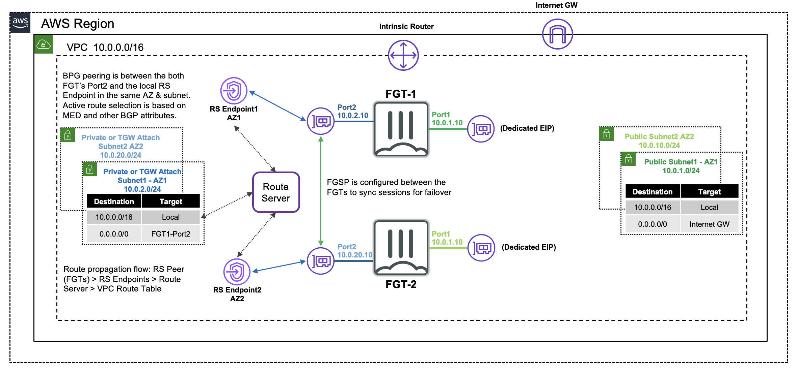
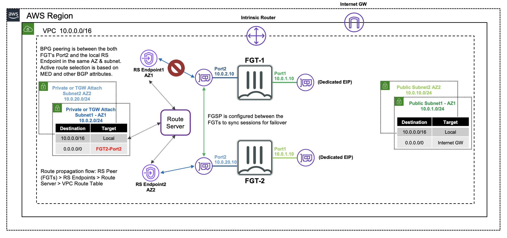

## Welcome

The purpose of this site is to provide a quick start guide for using Infrastructure as Code (IaC) templates located in the repo [**fortigate-aws-vpc-routeserver-active-active-cloudformation**](https://github.com/FortinetCloudCSE/fortigate-aws-vpc-routeserver-active-active-cloudformation).

Reference the prerequisites and deployment sections on this site to get started.

For other documentation needs such as FortiOS administration, please reference [**docs.fortinet.com**](https://docs.fortinet.com/). 
