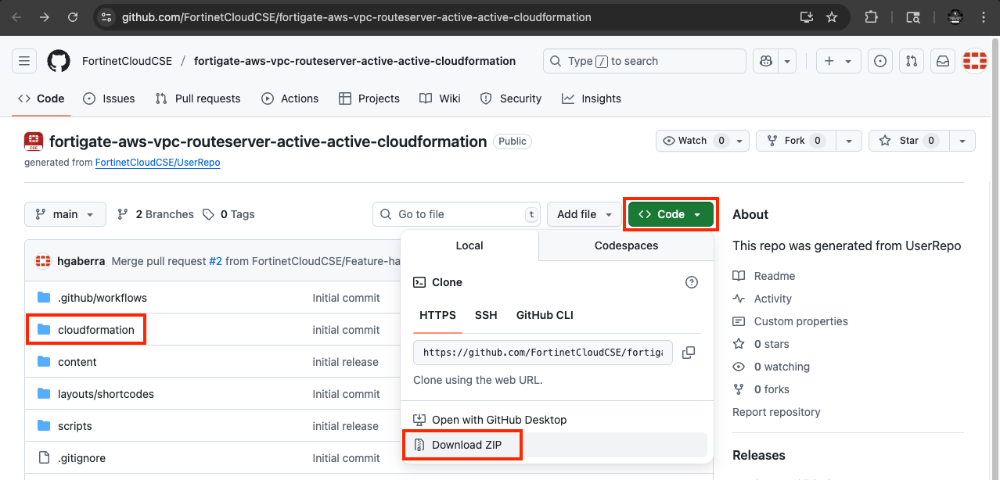
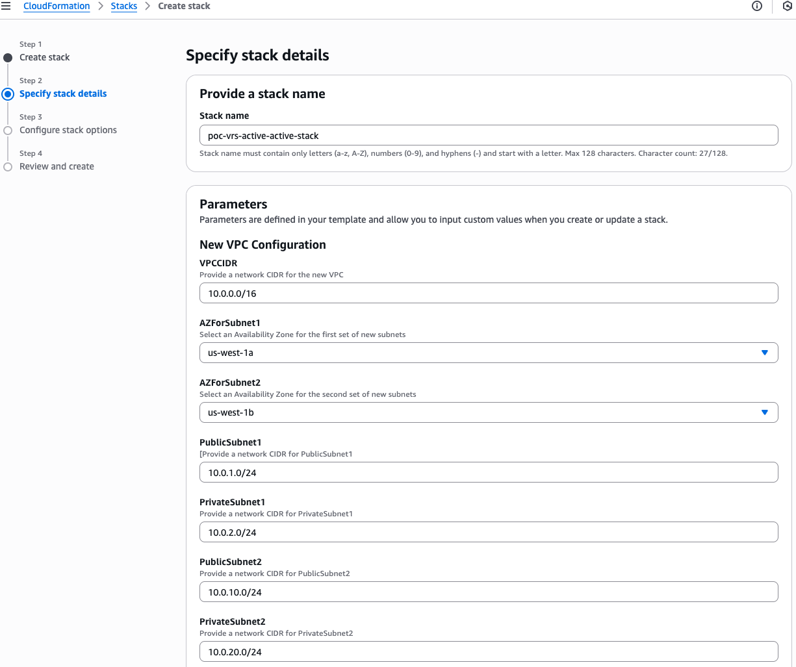
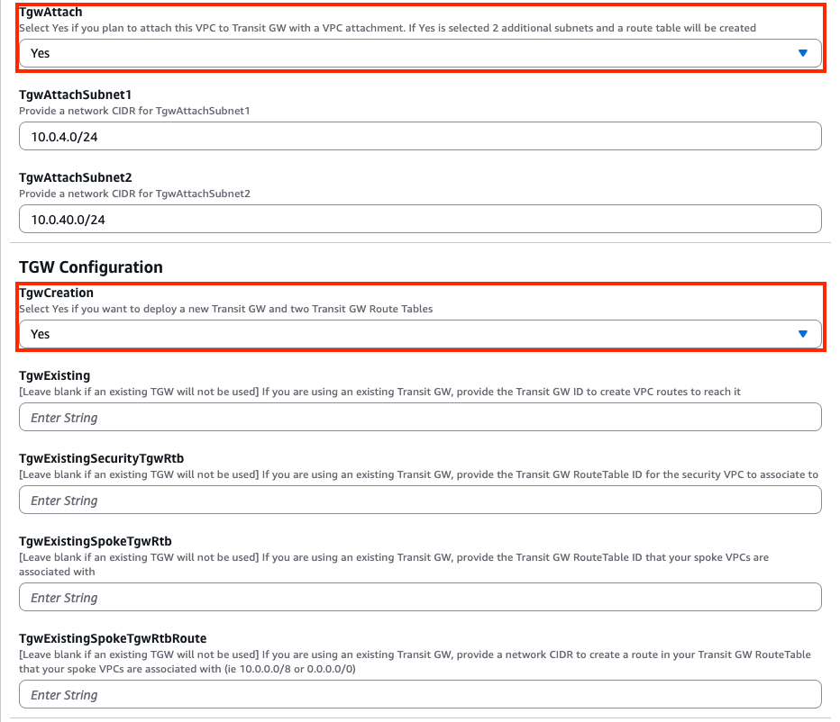
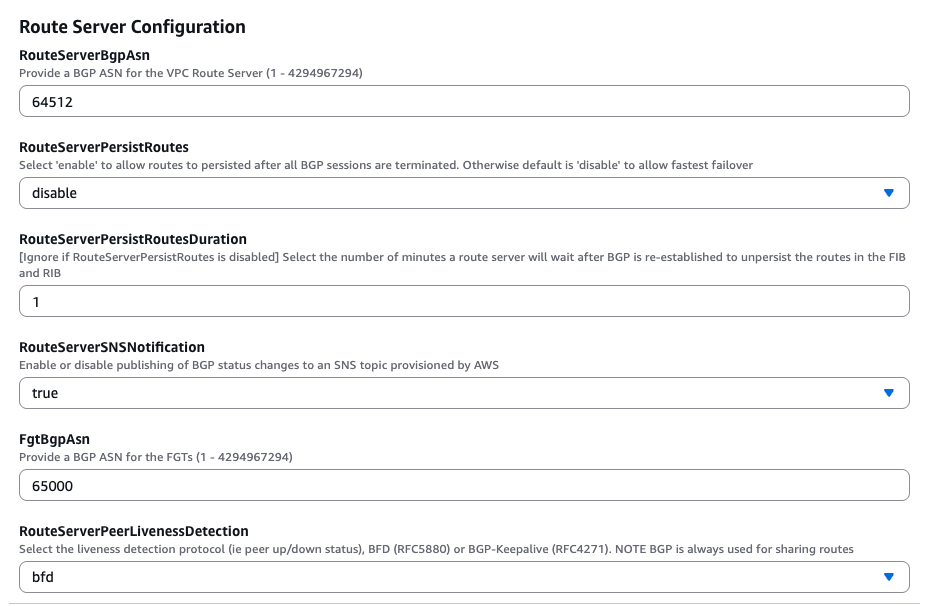
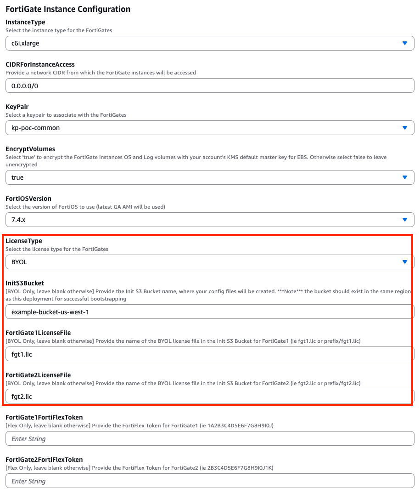
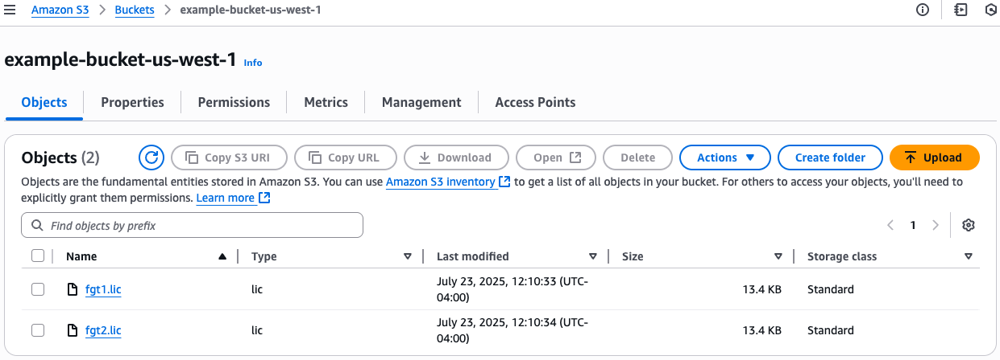
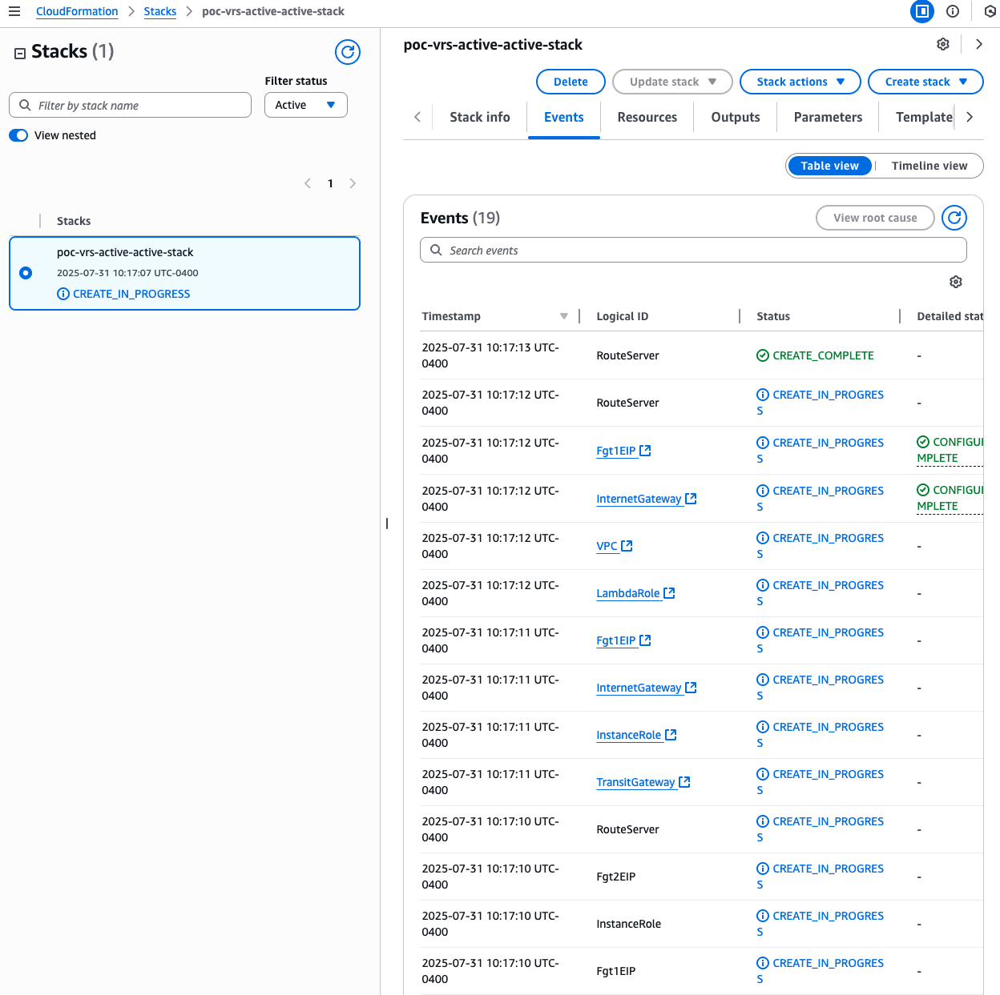
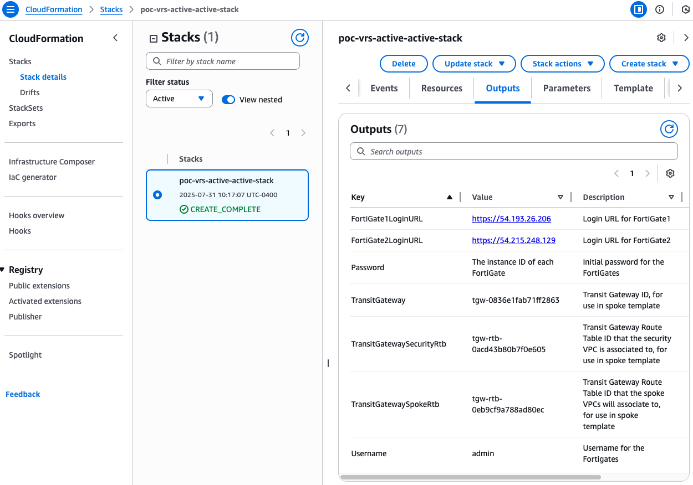
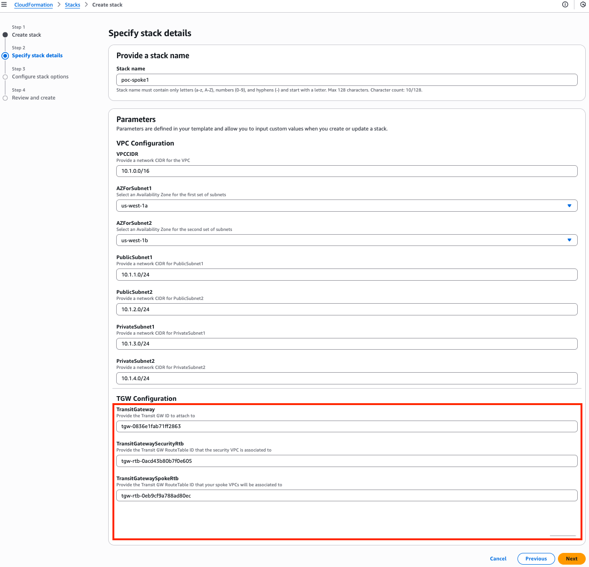

Once the prerequisites have been satisfied proceed with the deployment steps below.

1.  To download the templates, you can either clone the repo with the git command below, or [**download**](https://github.com/FortinetCloudCSE/fortigate-aws-vpc-routeserver-active-active-cloudformation) the repo as a ZIP archive.  The templates themselves are located in the **/cloudformation folder**

```
git clone https://github.com/FortinetCloudCSE/fortigate-aws-vpc-routeserver-active-active-cloudformation.git
```

  

2.  Login to your AWS account.  In the AWS services page under All Services > Management Tools, select CloudFormation.

  

3.  Select Create Stack then select with new resources.

  

4.  On the Select Template page, under the Choose a Template section select Upload a template to Amazon S3 and browse to your local copy of the chosen deployment template.

  

5.  On the Specify Details page, you will be prompted for a stack name and parameters for the deployment.  We are using the **'NewSecurityVPC_RouteServer_ActiveActive.template.json'** template which deploys a new VPC, gives options for TGW integration, and deploys the FGTs as well.

  
	
  We are choosing to deploy TGW so we have set both **'TgwAttach'** and **'TgwCreation'** to **'Yes'**.  Note you can also attach to an existing TGW by changing 'TgwCreation' to 'No' and providing the appropriate values for the 'TgwExisting...' parameters.

  

6.  In the Route Server Configuration parameters section, we are going with the defaults in this example. For more information on these parameters, reference this [**AWS Documentation**](https://docs.aws.amazon.com/vpc/latest/userguide/route-server-tutorial-create.html).

  

7.  In the FortiGate Instance Configuration parameters section, we have selected an Instance Type and Key Pair to use for the FortiGates, chose to encrypt both OS and Log disks, as well as BYOL licensing.  Notice we are prompted the InitS3Bucket where the licenses are stored, License Types, FortiGate1LicenseFile, and FortiGate2LicenseFile parameters.  For the values we are going to reference the S3 bucket and relevant information from the deployment prerequisite step 4.

  
	
  **Notice** that the license files are in the root directory of the S3 bucket, so we did not need to specify a prefix in our values for FortiGate1LicenseFile and FortiGate2LicenseFile.
	
  

8.  On the Options page, you can scroll to the bottom and select Next.

9.  On the Review page, scroll down to the capabilities section.  As the template will create IAM resources, you need to acknowledge this by checking the box next to ‘I acknowledge that AWS CloudFormation might create IAM resources’ and then click Submit.

  

10.  On the main AWS CloudFormation console, you will now see your stack being created.  You can monitor the progress by selecting your stack and then select the Events tab.

  

11.  Once the stack creation has completed successfully, select the Outputs tab to get the login information for the FortiGate instances and cluster.  If you chose to deploy a new TGW as part of the deployment you will see the IDs of your Transit Gateway and relevant TGW Route Tables.  These will be used as inputs for the **'SpokeVPC_TGW_DualAZ.template.json'** template.

  

12.  Here is an example of deploying a spoke VPC using the **'SpokeVPC_TGW_DualAZ.template.json'** template.  Note we are referencing the relevant IDs for Transit Gateway and relevant TGW Route Tables created for us using the **'NewSecurityVPC_RouteServer_ActiveActive.template.json'** template.

  
